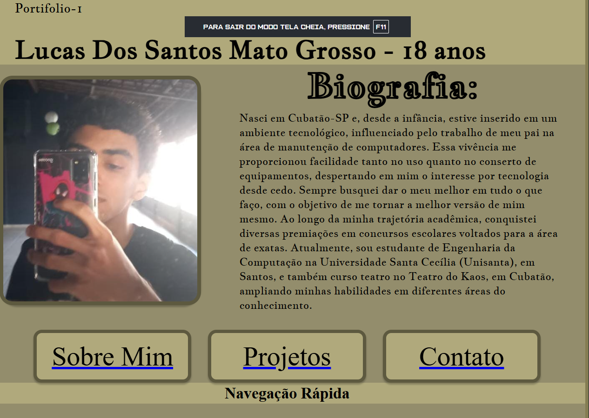

[README_Portfolio.md](https://github.com/user-attachments/files/22373202/README_Portfolio.md)
# 📁 Portfólio Pessoal – Parte 1

Este é meu projeto final desenvolvido durante o curso **Tecnologia Web - Engenharia da Computação (Front-End)**. Trata-se de um site de portfólio pessoal com informações sobre mim, meus projetos e formas de contato.

---

## 📌 Sobre o Projeto

Este site foi criado com foco em aplicar os conhecimentos de **HTML** e **CSS** e desenvolver melhores praticas de estruturação.

O projeto foi dividido em duas fases:
- **Parte 1 (12/09)** Estruturação HTML e protótipo no Figma  
- **Parte 2 (13/09):** Finalização com responsividade, interatividade e publicação online

---

## 🧪 Funcionalidades

- Página **Sobre Mim** com imagem e descrição.
- Seção de **Projetos** com links e descrições.
- Formulário de **Contato** com validação básica e 100% de responsividade.
- **Animações** e efeitos visuais com CSS.

---

## 🧰 Tecnologias Utilizadas

- HTML5
- CSS3 + Flexbox
- Google Fonts
- GitHub
- GitHub Pages (para publicação)

---

## 🎨 Protótipo (Figma ou Similar)

Link para o protótipo criado no Figma:  
[🔗 Ver protótipo](https://www.figma.com/design/qlVqaqI7XNchmthkLCzI3p/Portif%C3%B3lio---Parte-1?node-id=0-1&t=TLhQwB0orNnO9bpq-1)

---

## 🔗 Acesso ao Projeto

- **GitHub Pages:** [Clique aqui para acessar o site](https://spaik1541.github.io/Portifolio-parte-1)
- **Repositório GitHub:** [Acesse o código-fonte aqui](https://github.com/Spaik1541/Portifolio-parte-1)

---

## 📸 Capturas de Tela

---

## 📄 Licença

Este projeto é de uso educacional, criado como parte da disciplina **Tecnologia Web**.

---

## 🙋‍♀️ Desenvolvido por

**Lucas dos Santos Mato Grosso e 257332**  
Turma: [Segundo Semestre de 2025 - Noturno]  
Email: [lucasdossantosmatogrosso@gmail.com]  
GitHub: [https://github.com/Spaik1541/Portifolio-parte-1]
